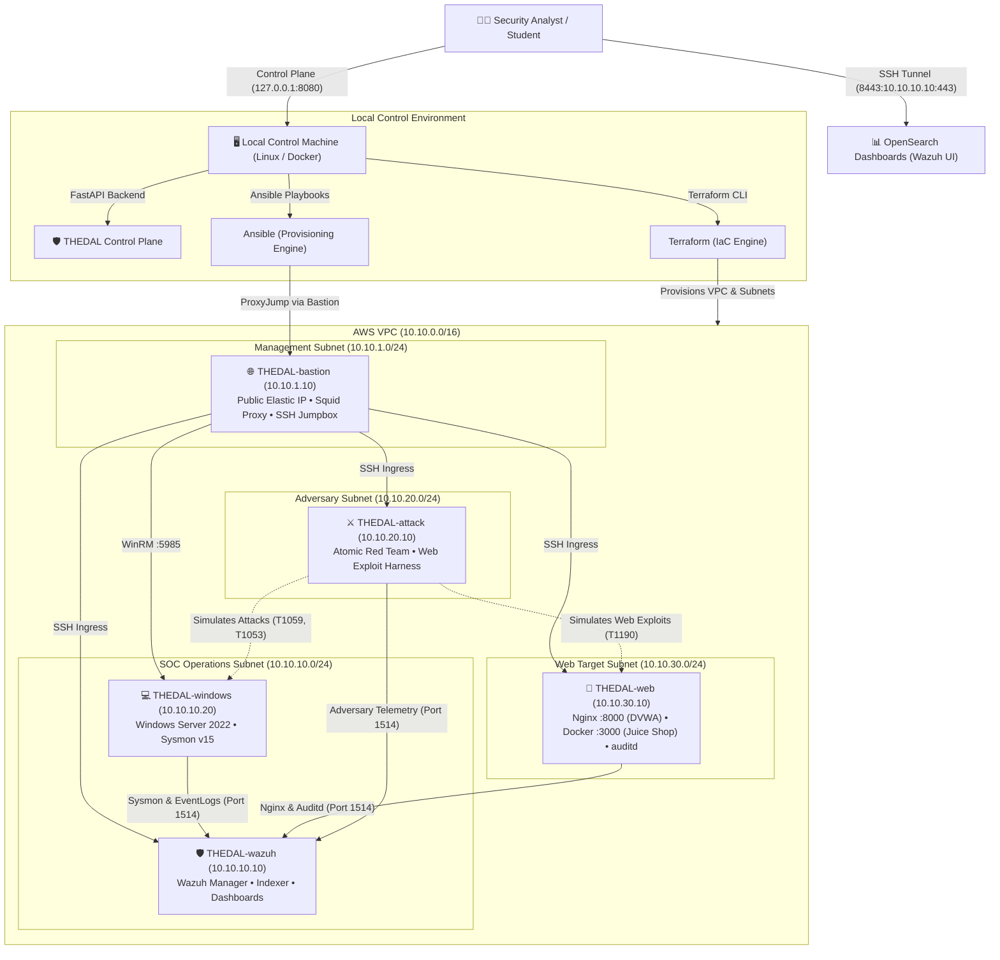
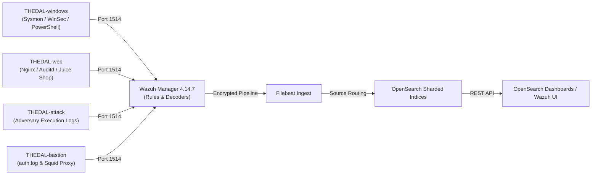

<h1 align="center">THEDAL</h1>

<p align="center">
  <strong>Threat Hunting, Exploration, Detection, Analysis and Learn</strong>
</p>

<p align="center">
  A reproducible cybersecurity range for adversary simulation, telemetry analysis, detection engineering, and SOC investigation.
</p>

<p align="center">
  <em>Attack the environment. Observe the telemetry. Build the detection. Investigate the incident.</em>
</p>

<p align="center">
  <a href="LICENSE"></a>
  <a href="https://thedal06.netlify.app/"></a>
  <a href="https://aws.amazon.com/"></a>
  <a href="https://www.terraform.io/"></a>
  <a href="https://www.ansible.com/"></a>
  <a href="https://wazuh.com/"></a>
  <a href="https://opensearch.org/"></a>
  <a href="https://www.python.org/"></a>
</p>

---

**🚀 Explore the Interactive THEDAL Architecture**

> Experience the THEDAL cyber range visually — explore the 5-node AWS architecture, network topology, telemetry data flow, and attack-to-detection workflow.

👉 **[Launch Interactive Showcase (thedal06.netlify.app)](https://thedal06.netlify.app/)**

---

## Explore

- [What is THEDAL?](#what-is-thedal)
- [Quick Start](#quick-start)
- [Architecture](#architecture)
- [How THEDAL Works](#how-thedal-works)
- [Five-Node Cyber Range](#five-node-cyber-range)
- [Telemetry Pipeline](#telemetry-pipeline)
- [Adversary Simulation](#adversary-simulation)
- [Guided Labs](#guided-labs)
- [Control Plane](#control-plane)
- [Interactive Architecture Showcase](#interactive-architecture-showcase)
- [Built with Antigravity](#built-with-antigravity)
- [Installation & Setup](#installation--setup)
- [Accessing the Range](#accessing-the-range)
- [AWS Cost & Safety](#aws-cost--safety)
- [Repository Structure](#repository-structure)
- [Testing & Validation](#testing--validation)
- [Troubleshooting](#troubleshooting)
- [Contributing](#contributing)
- [Security & Responsible Use](#security--responsible-use)
- [License](#license)

---

## What is THEDAL?

Traditional cybersecurity training often relies on static capture-the-flag (CTF) challenges or passive, pre-recorded log dumps. These approaches fail to teach frontline Security Operations Center (SOC) workflows because:

1. **Lack of Enterprise Context**: Real investigations require distinguishing benign system noise (administrative scripts, scheduled tasks, routine updates) from genuine adversary activity.
2. **Missing Process Lineages**: Static logs do not allow analysts to trace parent-child process creation trees (Sysmon Event ID 1), examine command-line arguments, or de-obfuscate in-memory PowerShell ScriptBlocks (Event ID 4104).
3. **No Multi-Source Correlation**: Analysts must learn how a single adversary intrusion generates correlated events across web reverse proxies (Nginx), Linux kernel syscalls (`auditd`), container logs, and Windows EventLogs.

THEDAL solves this by providing a reproducible, production-grade cloud cyber range provisioned automatically via Infrastructure as Code (Terraform & Ansible) in Amazon Web Services (AWS).

| Dimension | Traditional Lab / CTF | THEDAL Cloud Cyber Range |
| :--- | :--- | :--- |
| **Investigation Telemetry** | Static CSV or pre-recorded PCAP dump | Live streaming Sysmon, auditd, and Nginx logs in OpenSearch |
| **Process Lineage Visibility** | Opaque binary without parent/child tree | Full Sysmon EventID 1 process tree, command lines & hashes |
| **Multi-Source Correlation** | Single isolated log file without context | Cross-host correlation across Windows, Linux & web in Wazuh |
| **Adversary Simulation** | Pre-canned flag searching | 1-Click execution of real Atomic Red Team & web attack payloads |
| **Infrastructure Realism** | Monolithic container with mocked ports | 5-Node production AWS VPC with deterministic static subnets |
| **Provisioning Automation** | Manual setup or undocumented scripts | Automated Infrastructure as Code (Terraform + Ansible) |

---

## Quick Start

THEDAL supports two operator runtime modes:

### Option A: Native Linux / VM (Full CLI + Web Experience)

Recommended for engineers who want direct terminal access to Terraform, Ansible, and AWS CLI:

```bash
git clone https://github.com/EswaranS-06/THEDAL.git
cd THEDAL

./install.sh --mode native
make control-plane
```

Access the Control Plane: **`http://localhost:8080`**

### Option B: Docker Container (Zero Host Tooling / Browser-First)

Recommended for Windows, macOS, or Linux users who want a zero-configuration, browser-driven experience without installing Terraform or Ansible on the host:

```bash
git clone https://github.com/EswaranS-06/THEDAL.git
cd THEDAL

./install.sh --mode docker
```

Access the Control Plane: **`http://localhost:8080`**

### Runtime Comparison

| Capability | Native Linux / VM | Docker Container |
| :--- | :--- | :--- |
| **Control Plane Web UI** | Yes (`http://localhost:8080`) | Yes (`http://localhost:8080`) |
| **Direct Makefile CLI** | Yes (Host terminal) | Yes (`docker exec` or container CLI) |
| **Host Tooling Required** | Python 3.11+, Terraform, Ansible | Docker engine only |
| **AWS Lifecycle Management** | CLI + Web Dashboard | Web Dashboard |
| **SSH ProxyJump Automation** | Native OpenSSH | Containerized OpenSSH |
| **Wazuh Dashboard Ingress** | Native SSH Tunnel (`make tunnel`) | Web Dashboard Tunnel Manager |

---

## Architecture

THEDAL deploys a deterministic five-node AWS range inside a dedicated Virtual Private Cloud (`10.10.0.0/16`), isolating management, SOC operations, adversary simulation, and web application workloads into dedicated subnet tiers.



---

## How THEDAL Works

```mermaid
flowchart LR
    A[1. Adversary Simulation] -->|Executes TTPs| B[2. Target Systems]
    B -->|Generates Events| C[3. Telemetry Ingest]
    C -->|Encrypted Port 1514| D[4. Wazuh SIEM]
    D -->|Indexes Shards| E[5. OpenSearch]
    E -->|Rules Triggered| F[6. Detection & Triage]
    F -->|Evidence Artifacts| G[7. SOC Investigation]
```



1. **Adversary Simulation**: The isolated attack host dispatches curated MITRE ATT&CK techniques (Atomic Red Team, curl/Python exploits) against target hosts.
2. **Target Execution**: Workload nodes (Windows Server 2022, Ubuntu Nginx/DVWA) execute the commands in realistic operating environments.
3. **Telemetry Generation**: Native logging hooks (Sysmon v15, PowerShell ScriptBlock logging, Nginx access logs, Linux kernel `auditd`) record granular execution metadata.
4. **Encrypted Ingestion**: Lightweight Wazuh agents forward event streams over encrypted TLS connections (Port 1514) to the central Wazuh Manager.
5. **Correlation & Indexing**: Wazuh applies rule decoders, correlates events across data sources, and Filebeat writes indexed documents into OpenSearch.
6. **Detection & Triage**: The analyst inspects alerts in OpenSearch Dashboards, filters out benign baseline noise, and examines parent-child process lineages.
7. **SOC Investigation**: The analyst documents the full multi-stage incident timeline, extracts Indicators of Compromise (IoCs), and authors custom detection rules.

---

## Five-Node Cyber Range

| Node Identifier | Static Private IP | Subnet Tier | Role & Operating System | Key Tooling & Telemetry |
| :--- | :--- | :--- | :--- | :--- |
| **THEDAL-bastion** | `10.10.1.10` | `10.10.1.0/24` (Management) | Public Gateway • Ubuntu 22.04 LTS | Hardened SSH Jumpbox, Squid Forward Proxy (`:3128`), Public Elastic IPv4, `$0` NAT cost |
| **THEDAL-wazuh** | `10.10.10.10` | `10.10.10.0/24` (SOC Tier) | SIEM Core • Ubuntu 22.04 LTS | Wazuh 4.14.7 Manager, OpenSearch Indexer, OpenSearch Dashboards (`:443`), Filebeat |
| **THEDAL-windows** | `10.10.10.20` | `10.10.10.0/24` (SOC Tier) | Endpoint Target • Windows Server 2022 | Microsoft Sysmon v15.15, PowerShell ScriptBlock (EID 4104), WinRM (`:5985`), Wazuh Agent |
| **THEDAL-web** | `10.10.30.10` | `10.10.30.0/24` (Web Tier) | Web Target • Ubuntu 22.04 LTS | Nginx Reverse Proxy, DVWA (`:8000`), OWASP Juice Shop (`:3000`), Linux kernel `auditd` |
| **THEDAL-attack** | `10.10.20.10` | `10.10.20.0/24` (Attack Tier) | Red Team Host • Ubuntu 22.04 LTS | Atomic Red Team (`Invoke-AtomicRedTeam`), automated web attack harness, execution audit logs |

---

## Telemetry Pipeline



### Source-Specific Index Patterns

#### Windows Endpoint Indices
* **`socforge-sysmon-*`**: Process creation (EventID 1), network connections (EventID 3), driver loads (EventID 6), process access (EventID 10), and file modification (EventID 11).
  * *Key Fields*: `data.win.eventdata.image`, `parentImage`, `commandLine`, `hashes`, `processId`
* **`socforge-powershell-*`**: In-memory ScriptBlock execution (EventID 4104) and module logging (EventID 4103).
  * *Key Fields*: `data.win.eventdata.scriptBlockText`, `scriptBlockId`, `path`
* **`socforge-windows-security-*`**: Windows Security log authentication events and privilege changes.
  * *Key Fields*: `data.win.system.eventID` (4624 logon, 4625 failed auth, 4672 special privileges, 4688 process creation)

#### Linux & Web Target Indices
* **`socforge-nginx-access-*`**: Reverse proxy access events capturing web exploit attempts.
  * *Key Fields*: `data.srcip`, `data.url`, `data.status`, `data.http_user_agent`, `data.request_method`
* **`socforge-auditd-*`**: Linux kernel syscall telemetry monitoring executable launches and file access.
  * *Key Fields*: `data.audit.syscall` (`execve` 59), `data.audit.exe`, `data.audit.key`, `data.audit.uid`
* **`socforge-juice-shop-*`**: Containerized application logs capturing REST API manipulation.
  * *Key Fields*: `data.docker.container_name`, `data.message`

#### SIEM Alert Correlation Index
* **`wazuh-alerts-*`**: Normalized, enriched security alert stream with MITRE ATT&CK tagging and rule severity levels.
  * *Key Fields*: `rule.id`, `rule.level`, `rule.description`, `rule.mitre.id`, `rule.mitre.tactic`

---

## Adversary Simulation

THEDAL includes pre-configured adversary emulation capabilities designed to generate deterministic, observable telemetry across target hosts:

| Technique Name | MITRE ATT&CK ID | Simulation Scenario | Ingest Log Source |
| :--- | :--- | :--- | :--- |
| **PowerShell ScriptBlock Obfuscation** | `T1059.001` | Obfuscated in-memory credential dumper invocation (`Invoke-Mimikatz` hook) | `socforge-powershell-*` (EID 4104) |
| **Web Exploitation (SQLi / LFI)** | `T1190` | URI parameter injection against DVWA and REST API probing against Juice Shop | `socforge-nginx-access-*` |
| **Scheduled Task Persistence** | `T1053.005` | System boot trigger registration via `schtasks.exe /create` | `socforge-sysmon-*` (EID 1) |
| **Command & Scripting Interpreter** | `T1059.004` | Semicolon command chaining triggering `/bin/cat /etc/passwd` | `socforge-auditd-*` (Syscall 59) |
| **System Information Discovery** | `T1082` | Automated host reconnaissance burst (`systeminfo`, `net config`) | `socforge-sysmon-*` (EID 1) |

> [!CAUTION]
> **Authorized Testing Boundary**: All adversary simulation capabilities in THEDAL are strictly restricted to the isolated private subnets within your own AWS VPC. Never target external networks or unauthorized infrastructure.

---

## Guided Labs

THEDAL provides a progressive 4-tier curriculum taking learners from foundational log anatomy to multi-source attack timeline correlation:

```text
LEVEL 1: SOC FOUNDATIONS ──► LEVEL 2: INVESTIGATION WORKFLOWS ──► LEVEL 3: ATTACK CORRELATION ──► CHALLENGE MODE
```

### Level 1 — SOC Foundations
* [Lab 01: First Alert Triage & Log Anatomy](docs/labs/01-first-alert/README.md) — Inspect raw EventLogs vs SIEM alerts; explore Sysmon schema fields.
* [Lab 02: Windows Process Creation & Lineage](docs/labs/02-windows-process/README.md) — Trace parent-child PID trees (EventID 1) and command-line arguments.
* [Lab 03: PowerShell ScriptBlock Investigation](docs/labs/03-powershell-investigation/README.md) — De-obfuscate Base64 commands from ScriptBlock logs (EventID 4104).
* [Lab 04: Failed Authentication & Password Spraying](docs/labs/04-failed-authentication/README.md) — Distinguish routine user typos from brute-force bursts (EventID 4625).

### Level 2 — Investigation Workflows
* [Lab 05: DVWA SQL Injection Triage](docs/labs/05-dvwa-sqli/README.md) — Analyze HTTP GET URI parameters with Boolean and UNION SQLi payloads.
* [Lab 06: Remote OS Command Injection & Auditd](docs/labs/06-dvwa-command-injection/README.md) — Correlate web semicolon chaining with kernel `execve` syscalls.
* [Lab 07: Local File Inclusion (LFI) Investigation](docs/labs/07-dvwa-lfi/README.md) — Detect path traversal patterns (`../../`) probing configuration assets.
* [Lab 08: OWASP Juice Shop API Probing](docs/labs/08-juice-shop-api/README.md) — Inspect Docker JSON container logs capturing authentication bypass payloads.

### Level 3 — Attack Correlation
* [Lab 09: Atomic Red Team Reconnaissance](docs/labs/09-atomic-red-team/README.md) — Emulate discovery commands and analyze burst frequency patterns in SIEM.
* [Lab 10: PowerShell Obfuscation & Bypass Flags](docs/labs/10-powershell-attack/README.md) — Decode encoded commands and identify execution bypass parameters.
* [Lab 11: Scheduled Task Persistence Creation](docs/labs/11-scheduled-task/README.md) — Track `schtasks.exe /create` persistence registration and audit task triggers.
* [Lab 12: Multi-Source Incident Correlation](docs/labs/12-multi-source-correlation/README.md) — Correlate web intrusion, kernel execve, and Windows lateral movement (`DET-COR-001`).
* [Lab 13: True Positive vs False Positive Discrimination](docs/labs/13-tp-vs-fp/README.md) — Evaluate realistic IT maintenance noise vs adversary activity.
* [Lab 14: Full Incident Timeline Reconstruction](docs/labs/14-incident-timeline/README.md) — Author an end-to-end incident report from initial access to objective execution.

### Challenge Mode — Blind Mystery Investigations
* [Challenge 01: Web Tampering & Webshell](docs/labs/challenges/challenge-01-web-tampering.md) — Unassisted investigation of an unauthorized web application modification.
* [Challenge 02: Suspicious Admin Elevation](docs/labs/challenges/challenge-02-suspicious-admin.md) — Detect rogue administrator account creation and unauthorized group changes.
* [Challenge 03: Stealth Host Enumeration](docs/labs/challenges/challenge-03-stealth-enumeration.md) — Hunt low-and-slow internal subnet port scanning and service discovery.

---

## Control Plane

THEDAL includes a local FastAPI web operations dashboard designed for safe lifecycle management, adversary dispatch, and progress tracking:

```bash
make control-plane
```

Access the dashboard: **`http://127.0.0.1:8080`**

* **Compute Fleet Controls**: Start, pause, or resume AWS EC2 instances with single clicks to eliminate idle compute costs.
* **1-Click Adversary Dispatch**: Execute allowlisted Atomic Red Team and web attack scenarios without manual SSH terminal switching.
* **Dynamic IP & SSH Sync**: Automatically syncs the live Bastion public IP into local SSH configs and inventory files.
* **SSH Tunnel Management**: Manages background encrypted port forwarding (`https://localhost:8443`) to OpenSearch Dashboards.
* **Audit Trail**: Every simulation execution and state transition is audited locally in SQLite (`learner_state.db`).

---

## Interactive Architecture Showcase

The repository includes an interactive frontend application for reviewing and exploring the cyber range architecture:

👉 **[https://thedal06.netlify.app/](https://thedal06.netlify.app/)**

* **Living Network Topology**: Interactive React Flow map visualizing the 5-node AWS VPC, private subnets, and Squid proxy gateway.
* **Three Flow Modes**:
  * **`Architecture Mode`**: Full VPC infrastructure topology and private subnet routing.
  * **`Data Flow Mode`**: Active telemetry conduits streaming Sysmon and Nginx events to Wazuh on port 1514.
  * **`Attack Flow Mode`**: Adversary simulation dispatch, endpoint payload execution, and SIEM rule correlation.
* **Live Telemetry Readout**: Real-time event inspector displaying adversary command payloads, raw event JSON, and Wazuh detection rules.
* **Node Spec Inspector**: Click any node in the topology to view its static IP, operating system, open ports, and configured telemetry channels.

---

## Built with Antigravity

The interactive THEDAL frontend experience was developed and refined using **Antigravity** as an AI-assisted engineering environment.

Antigravity was used to accelerate parts of the frontend development workflow, including:

* Designing the editorial visual language, typography scales, and dark infrastructure theme
* Implementing the interactive React Flow cyber range architecture visualizer
* Building the 1-click simulation state machine and real-time telemetry inspector
* Optimizing responsive layouts, eliminating heavy WebGL dependencies, and reducing bundle sizes
* Refactoring modular React components and establishing clean design tokens

The underlying THEDAL cybersecurity platform remains centered around authentic infrastructure and security engineering practices:

* **Terraform** for automated AWS VPC, subnet, and EC2 provisioning
* **Ansible** for idempotent security tooling and agent orchestration
* **Wazuh & OpenSearch** for enterprise telemetry ingestion and correlation
* **Atomic Red Team** for realistic adversary emulation
* **FastAPI** for local control plane operations and lifecycle management

---

## Installation & Setup

### Prerequisites

* **Operating System**: Linux (Debian 13 or Ubuntu 22.04+ recommended) or macOS / WSL2
* **AWS Account**: Configured AWS credentials with permissions for VPC, EC2, IAM, and Security Groups
* **Required CLI Tools**: `git`, `python3` (3.11+), `terraform` (1.5+), `ansible` (2.14+), `aws-cli` (v2), `ssh`

### Step 1: Configure AWS Credentials

```bash
aws configure
# Specify AWS Access Key ID, Secret Access Key, and Region (default: ap-south-1)

aws sts get-caller-identity
```

### Step 2: Create the SSH Key Pair

```bash
ssh-keygen -t ed25519 -f ~/.ssh/thedal_key -N ""
```

### Step 3: Verify Prerequisites

```bash
make preflight
```

### Step 4: Preview Infrastructure Plan

```bash
make plan
```

### Step 5: Provision AWS Infrastructure

```bash
make deploy
```

### Step 6: Generate Dynamic Ansible Inventory

```bash
make inventory
```

### Step 7: Configure and Provision the Range

```bash
make provision
```

---

## Accessing the Range

### Wazuh SIEM & OpenSearch Dashboards

Establish the encrypted background SSH tunnel through the Bastion jumpbox:

```bash
make tunnel
```

Open in your browser: **`https://localhost:8443`**

* **Default Lab Username**: `admin`
* **Default Lab Password**: `SOCForge_Adm1n_Lab2026!`

> [!NOTE]
> Default credentials are intended strictly for isolated lab training. Change default passwords for personal or long-lived cloud deployments.

### Local Control Plane

```bash
make control-plane
```

Open in your browser: **`http://127.0.0.1:8080`**

---

## AWS Cost & Safety

> [!WARNING]
> **Cloud Cost Notice**: Running EC2 instances incurs hourly compute charges. Manage your infrastructure lifecycle responsibly.

* **Zero NAT Gateway Policy**: Eliminates ~$32+/month in AWS managed NAT Gateway fees by routing private subnet traffic through the Squid forward proxy on `THEDAL-bastion`.
* **Single Public IPv4**: Only the Bastion jumpbox allocates an Elastic IPv4 address. All target hosts remain in private subnets without public IPs.
* **Compute Lifecycle Management**:
  * **Pause Compute (`make stop-ec2`)**: Stops all 5 EC2 instances to halt hourly compute charges. Attached EBS storage charges continue.
  * **Resume Compute (`make start-ec2`)**: Restarts instances and re-syncs dynamic public Bastion IPs automatically.
  * **Complete Teardown (`make destroy`)**: Terminates all compute instances, security groups, and VPC assets, eliminating recurring charges completely.

```bash
# Pause compute fleet (save compute costs when not training)
make stop-ec2

# Resume compute fleet
make start-ec2

# Permanently destroy all AWS assets
make destroy
```

---

## Repository Structure

```text
THEDAL/
├── Makefile                     # Root automation CLI (preflight, deploy, provision, tunnel, stop, destroy)
├── install.sh                   # Universal interactive installer (native CLI or Docker mode)
├── hero-page/                   # High-performance React + Tailwind + React Flow interactive showcase
├── terraform/                   # Infrastructure as Code (AWS VPC, subnets, EC2 instances, security groups)
├── ansible/                     # Multi-node provisioning playbooks & configuration roles
│   ├── inventory/               # Dynamic host inventory (hosts.ini)
│   ├── playbooks/               # Sequential deployment playbooks (Bastion, Linux, Wazuh, Windows, Web, Attack)
│   └── roles/                   # Reusable Ansible roles for Sysmon, Wazuh, Nginx, and Auditd
├── control-plane/               # Local FastAPI web operations dashboard & simulation runner
│   ├── app/                     # Backend routes, services, templates, and state adapters
│   └── tests/                   # Automated API and unit test suite
├── detection/                   # Custom Wazuh detection rules, decoders, and OpenSearch Dashboards
├── attacks/                     # Adversary emulation wrappers, atomics, and web exploit test harnesses
├── docs/                        # Complete curriculum documentation, labs, and triage runbooks
│   ├── START-HERE.md            # Onboarding guide for new analysts
│   ├── learning-path.md         # 4-tier SOC mastery curriculum
│   ├── labs/                    # 14 guided threat hunting labs & 3 mystery challenges
│   ├── runbooks/                # 7 incident triage runbooks
│   └── templates/               # Incident report & triage checklist templates
└── scripts/                     # Operational verification, health checks, and tunnel scripts
```

---

## Testing & Validation

```bash
# Run repository-wide syntax and lint checks
make lint

# Run control plane automated unit and API test suite
make test-control-plane

# Execute end-to-end cloud infrastructure health verification
make health-check
```

---

## Troubleshooting

| Symptom | Probable Cause | Recommended Remediation |
| :--- | :--- | :--- |
| `WinRM connection refused` on Windows | Windows still running bootstrap setup | Wait 2–3 minutes after initial boot for Sysprep bootstrap to complete. |
| `Wazuh agent disconnected` | Service restart or network transit delay | Verify agent status: `systemctl status wazuh-agent` on the target host. |
| `Squid proxy connection timeout` | Security group ingress restriction | Ensure port `3128` is open to the internal VPC CIDR (`10.10.0.0/16`). |
| `Wazuh dashboard TLS warning` | Self-signed certificate on OpenSearch | Accept the browser self-signed TLS certificate warning for `localhost:8443`. |
| `SSH ProxyJump connection failed` | Public Bastion IP changed after restart | Run `make inventory` or use the Control Plane to re-sync the live IP. |

---

## Contributing

Contributions from detection engineers, SOC analysts, and cloud architects are welcome:

1. Fork the repository on GitHub.
2. Create a focused feature branch:
   ```bash
   git checkout -b feat/new-detection-rule
   ```
3. Run lint and test suites:
   ```bash
   make lint
   make test-control-plane
   ```
4. Submit a Pull Request with clear documentation and test evidence.

---

## Security & Responsible Use

> [!CAUTION]
> **Authorized Testing Only**: THEDAL is designed strictly for authorized security training and detection engineering within your own isolated cloud environment. Never target systems, networks, or infrastructure without explicit authorization.

---

## License

This project is open source and distributed under the **[MIT License](LICENSE)**.

---

<p align="center">
  <strong>THEDAL</strong> — <em>Attack. Observe. Detect. Investigate.</em>
</p>
