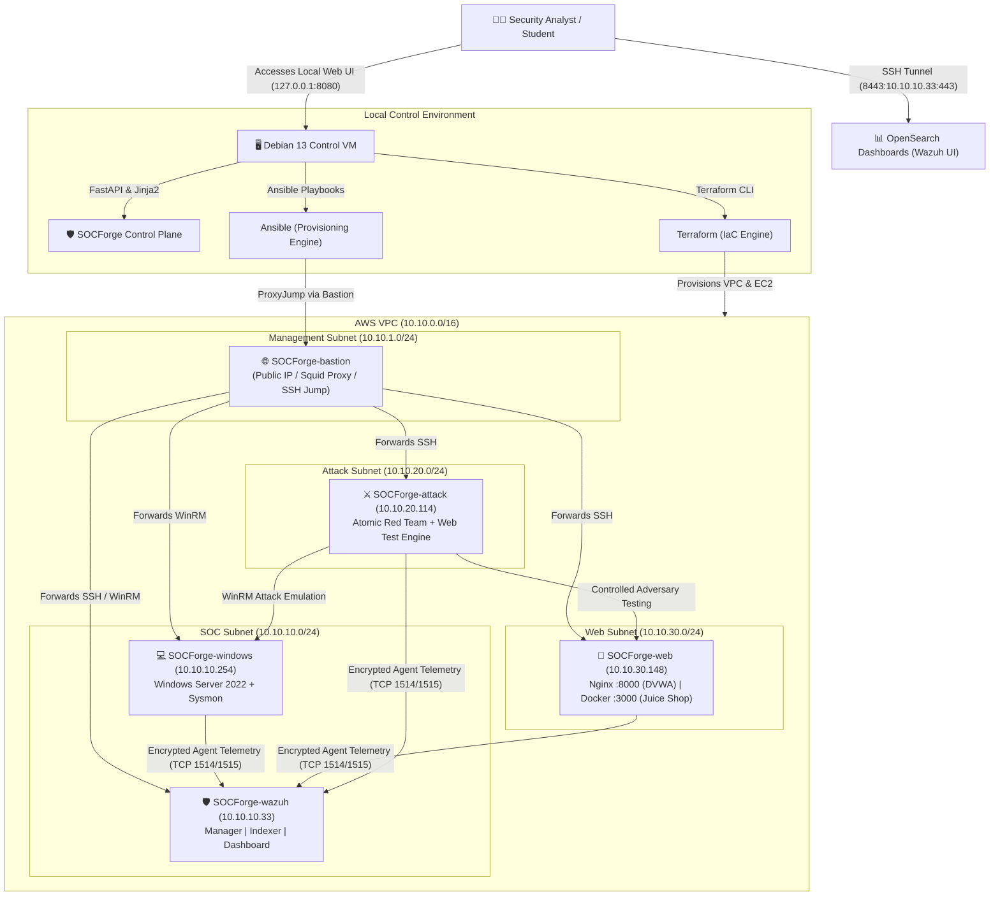

# SOCForge

> **SOCForge** is an open, reproducible, cloud-native **Security Operations Center (SOC) & Detection Engineering Laboratory** deployed on Amazon Web Services (AWS) using Terraform, Ansible, and Wazuh.

SOCForge bridges Infrastructure-as-Code (IaC), endpoint telemetry collection, central log routing, SIEM detection engineering, and adversary emulation into an integrated hands-on learning platform.

---

## 1. What SOCForge Does

SOCForge simulates an enterprise corporate cloud environment under active security monitoring and adversary testing:

- **Central SIEM / XDR Platform**: Deploys an all-in-one **Wazuh 4.14.7** stack (Wazuh Manager, Wazuh Indexer with OpenSearch, and Wazuh Dashboard).
- **Windows Endpoint Monitoring**: A Windows Server 2022 workstation configured with **Microsoft Sysmon** and the Wazuh Windows Agent, streaming Process Creation (Event ID 1), Network Connections (Event ID 3), and PowerShell ScriptBlock logs (Event ID 4104).
- **Linux Web Targets**: An Ubuntu web server running **Nginx**, **DVWA** (Damn Vulnerable Web Application on port `8000`), and a containerized **OWASP Juice Shop** on port `3000`.
- **Adversary Simulation Engine**: A dedicated attack host preloaded with **Atomic Red Team** and automated web exploitation harnesses.
- **Log Routing & Dedicated Index Pipeline**: Real-time routing via Filebeat and OpenSearch Ingest Pipelines into dedicated indices (`socforge-sysmon-*`, `socforge-powershell-*`, `socforge-windows-security-*`, `socforge-nginx-access-*`, `socforge-auditd-*`, `socforge-juice-shop-*`).
- **Guided SOC Analyst Learning Path**: 14 structured, step-by-step investigation labs and mystery challenges teaching alert triage, MITRE ATT&CK mapping, and incident reporting.
- **Local Web Control Plane**: A lightweight FastAPI dashboard running locally on `127.0.0.1:8080` for safe infrastructure lifecycle management, EC2 pausing, and audit logging.

---

## 2. Architecture Diagram



---

## 3. Technology Stack

| Layer | Component | Description & Role |
| :--- | :--- | :--- |
| **Infrastructure** | **Terraform** | VPC, subnets, route tables, security groups, IAM instance profiles, and EC2 instances. |
| **Cloud Provider** | **AWS (EC2 & VPC)** | Isolated virtual private cloud in `ap-south-1` (Mumbai) without NAT Gateways. |
| **Configuration** | **Ansible** | Automated host configuration, service bootstrapping, and Wazuh Agent enrollment. |
| **SIEM Stack** | **Wazuh 4.14.7** | Central manager, OpenSearch-compatible indexer, and web dashboard. |
| **Log Pipeline** | **Filebeat 7.10.2** | Ingest pipelines, dynamic index classification, and ILM/ISM retention policies. |
| **Endpoint Telemetry** | **Sysmon v15.15** | Advanced Windows process tracking, script execution, and network logging. |
| **Web Applications** | **Nginx + DVWA + Docker** | Nginx reverse proxy, PHP-based DVWA (:8000), and OWASP Juice Shop (:3000). |
| **Adversary Engine** | **Atomic Red Team** | Open-source adversary emulation mapped directly to MITRE ATT&CK matrices. |
| **Local Control Plane**| **Python / FastAPI** | Local dashboard with Jinja2, Uvicorn, Boto3, and operation concurrency locks. |

---

## 4. Directory Structure

```text
SOCForge/
├── control-plane/             # Local FastAPI web dashboard & operator controls
│   ├── app/
│   │   ├── main.py            # FastAPI entrypoint, page routing, and REST API
│   │   ├── config.py          # Environment settings and safe path resolution
│   │   ├── models.py          # Pydantic schemas for status, requests, and telemetry
│   │   ├── services/          # Safe wrappers for Terraform, Ansible, AWS, SSH, Health
│   │   ├── templates/         # Server-rendered HTML templates (Dark SOC design system)
│   │   └── static/            # CSS design tokens and vanilla JS interactivity
│   ├── logs/                  # Structured audit logs for all executed operations
│   ├── tests/                 # Unit and security test suite for control plane
│   ├── pyproject.toml         # Python project configuration
│   └── requirements.txt       # Control plane dependencies
│
├── terraform/                 # Infrastructure-as-Code definitions
│   ├── main.tf                # Provider configuration and core VPC module wiring
│   ├── variables.tf           # Configurable inputs (region, instance types, CIDRs)
│   ├── outputs.tf             # Node IPs, VPC IDs, and connection strings
│   └── modules/               # Modular definitions for VPC, Security Groups, IAM, EC2
│
├── ansible/                   # Automation playbooks and host configurations
│   ├── ansible.cfg            # Ansible runtime configuration and Bastion ProxyJump rules
│   ├── inventory/             # Dynamic hosts.ini generated from Terraform outputs
│   ├── playbooks/             # Modular playbooks (bootstrap, wazuh, windows, web, attack)
│   └── roles/                 # Reusable Ansible roles for each component
│
├── docs/                      # Comprehensive learning path, labs, and runbooks
│   ├── START-HERE.md          # Primary onboarding guide for students and analysts
│   ├── learning-path.md       # 3-level progressive SOC investigation curriculum
│   ├── labs/                  # 14 step-by-step guided hands-on investigation labs
│   │   └── challenges/        # 3 unassisted mystery investigation challenges
│   ├── runbooks/              # 7 analyst triage runbooks (Sysmon, PowerShell, Web, etc.)
│   ├── templates/             # Incident report and alert triage markdown templates
│   └── learning/              # SOC terminology glossary and index cheat sheets
│
├── scripts/                   # CLI verification and testing utilities
│   ├── preflight.sh           # Control machine prerequisite tool verification
│   ├── health-check.sh        # Local repository integrity check
│   ├── generate-inventory.py  # Synchronizes Terraform outputs into Ansible inventory
│   ├── wazuh-tunnel.sh        # Sets up SSH port forward for OpenSearch Dashboards
│   ├── run-atomic-test.sh     # Wrapper to trigger Atomic Red Team tests on attack host
│   └── run-web-test.sh        # Wrapper to trigger web exploitation scenarios
│
├── Makefile                   # Developer CLI targets (make lint, make control-plane, etc.)
└── README.md                  # Primary repository documentation
```

---

## 5. Requirements & Prerequisites

### Control Machine
- **Operating System**: Debian 13 (Trixie) or compatible modern Linux workstation.
- **Tools**:
  - `git` (>= 2.30)
  - `terraform` (>= 1.5)
  - `ansible` (>= 2.15)
  - `aws-cli` (v2)
  - `python3` (>= 3.11) and `uv` (recommended)
  - OpenSSH client

### AWS Account & IAM
- An active AWS Account.
- IAM User or Role with permissions to manage VPC, Subnets, Route Tables, Security Groups, IAM Roles/Instance Profiles, and EC2 instances.
- SSH Key Pair named `socforge_key` located at `~/.ssh/socforge_key`.

---

## 6. AWS Credential Security Policy

> 🔒 **SECURITY DIRECTIVE**
>
> 1. **Never commit AWS credentials** (`AWS_ACCESS_KEY_ID`, `AWS_SECRET_ACCESS_KEY`, `AWS_SESSION_TOKEN`) into Git repositories, Terraform variables (`terraform.tfvars`), Ansible playbooks, or documentation.
> 2. Always use the standard **AWS CLI credential chain** (`aws configure` or temporary session environment variables).
> 3. The SOCForge Control Plane uses the local credential chain via Boto3 and **never displays or logs** secret keys or passwords.

---

## 7. Deployment Workflow

Deploying SOCForge follows a structured 11-step progression:

```text
1. Clone Repository & Setup SSH Key (~/.ssh/socforge_key)
                 ↓
2. Configure AWS CLI Credentials (aws configure)
                 ↓
3. Initialize Terraform (terraform -chdir=terraform init)
                 ↓
4. Review Infrastructure Plan (terraform -chdir=terraform plan)
                 ↓
5. Deploy AWS Infrastructure (terraform -chdir=terraform apply)
                 ↓
6. Generate Ansible Inventory (python3 scripts/generate-inventory.py)
                 ↓
7. Run Ansible Provisioning (make wazuh-deploy windows-agent-deploy web-target-deploy ...)
                 ↓
8. Execute Health Check Diagnostics (make health-check wazuh-check detection-check)
                 ↓
9. Open Wazuh Dashboard Tunnel (make wazuh-tunnel -> https://localhost:8443)
                 ↓
10. Start Local Control Plane (make control-plane -> http://127.0.0.1:8080)
                 ↓
11. Begin Guided Investigation Labs (docs/START-HERE.md & docs/labs/)
```

---

## 8. SOCForge Control Plane

The SOCForge Control Plane is a local web application built with FastAPI and Jinja2 that simplifies day-to-day lab operations without bypassing Terraform or Ansible.

### Launching the Dashboard
```bash
# Option 1: Via Makefile
make control-plane

# Option 2: Directly via uv
cd control-plane
uv run uvicorn app.main:app --host 127.0.0.1 --port 8080
```

Access the UI at **`http://127.0.0.1:8080`**.

### Key Features
- **Strict Localhost Binding**: Listens only on `127.0.0.1`.
- **Zero Arbitrary Commands**: Only pre-authorized, allowlisted actions can be triggered.
- **Concurrency Protection**: File lock (`.operation.lock`) prevents overlapping Terraform or Ansible runs.
- **Destroy Guardrail**: `terraform destroy` requires checking a confirmation box and typing **`DESTROY SOCFORGE`**.
- **Audit Logging**: Every operation outputs structured, sanitized logs to `control-plane/logs/`.

---

## 9. AWS Cost Management & Sizing

SOCForge is engineered with cloud cost discipline:

- **Zero NAT Gateway Architecture**: Saves ~$32+/month by utilizing an open-source Squid forward proxy on the Bastion host for outbound package updates.
- **Single Public IPv4 Address**: Only the Bastion jumpbox allocates an Elastic Public IP, avoiding excess AWS IPv4 reservation fees.
- **Instance Sizing**:
  - `SOCForge-bastion`: `t3.micro` (1 vCPU, 1 GB RAM)
  - `SOCForge-wazuh`: `m7i-flex.large` / `t3.xlarge` (2–4 vCPU, 8–16 GB RAM)
  - `SOCForge-windows`: `t3.medium` (2 vCPU, 4 GB RAM)
  - `SOCForge-web`: `t3.small` (2 vCPU, 2 GB RAM)
  - `SOCForge-attack`: `t3.small` (2 vCPU, 2 GB RAM)

### Pausing vs. Destroying
| Action | Command / Control | Billing Impact |
| :--- | :--- | :--- |
| **Stop EC2 Compute** | Control Plane `Stop Nodes` or AWS API | Compute hourly fees stop. Attached EBS storage (~$0.10/GB/month) continues. |
| **Destroy Infrastructure** | Control Plane `Destroy Lab` or `terraform destroy` | **All compute and EBS volumes are terminated.** Eliminates all recurring charges. |

---

## 10. Troubleshooting

| Symptom | Diagnosis / Check | Solution |
| :--- | :--- | :--- |
| **AWS Authentication Error** | `aws sts get-caller-identity` fails. | Run `aws configure` to re-enter valid access keys or refresh session tokens. |
| **Terraform Plan / Apply Failure** | Terraform returns resource or quota error. | Verify AWS account limits for EC2 instances and VPCs in `ap-south-1`. |
| **SSH Jumpbox Connection Refused** | Cannot reach Bastion jumpbox. | Check security group ingress for your current public IP (`my_ip` in `terraform.tfvars`). |
| **Squid Proxy Outbound Failure** | Private nodes fail `apt update` or internet access. | Verify Squid service is running on Bastion: `sudo systemctl status squid`. |
| **WinRM Connection Failure** | Ansible cannot communicate with Windows node. | Ensure Windows startup userdata script has completed and WinRM service is listening on port 5985. |
| **Wazuh Dashboard Inaccessible** | `https://localhost:8443` does not load. | Run `make wazuh-tunnel` to verify the SSH port forwarding tunnel is active. |
| **Wazuh Agent Offline** | Agent not appearing in Wazuh Dashboard. | Check agent service status: `sudo systemctl status wazuh-agent` (Linux) or Windows Service manager. |
| **Docker / Juice Shop Error** | Juice Shop not reachable on port 3000. | Check Docker container state on `SOCForge-web`: `sudo docker ps -a`. |
| **OpenSearch Dynamic Index Error** | Telemetry logs not routing to custom index. | Verify ingest pipeline health: `make wazuh-index-check`. |
| **Control Plane Locked** | Operation button disabled due to lock. | Verify if an operation is running; if orphaned, remove `control-plane/.operation.lock`. |

---

## 11. Learning Curriculum & Labs

SOCForge provides an analyst training track:

- 🚀 [**Getting Started Guide (`docs/START-HERE.md`)**](docs/START-HERE.md): Core concepts, architecture, and connection guide.
- 🗺️ [**Learning Path (`docs/learning-path.md`)**](docs/learning-path.md): 3-level progression from beginner to incident responder.
- 🔬 [**14 Guided Investigation Labs (`docs/labs/`)**](docs/labs/):
  - **Level 1 (Beginner)**: First Alert, Windows Process Lineage, PowerShell Obfuscation, Brute-Force Authentication.
  - **Level 2 (Intermediate)**: DVWA SQLi, Command Injection & Syscall Correlation, LFI Traversal, Juice Shop API Abuse.
  - **Level 3 (Advanced)**: Atomic Red Team Host Recon, Defense Evasion, Persistence, Multi-Source Correlation, TP vs. FP Triage, Incident Timeline Construction.
- 🕵️ [**Mystery Challenges (`docs/labs/challenges/`)**](docs/labs/challenges/): 3 unassisted forensic investigations.
- 📖 [**Analyst Runbooks (`docs/runbooks/`)**](docs/runbooks/): 7 standardized operational triage playbooks.
- 📝 [**Investigation Templates (`docs/templates/`)**](docs/templates/): Professional markdown templates for incident reporting.

---

## 12. Project Status

| Area | Status | Notes |
| :--- | :--- | :--- |
| **Infrastructure** | `VALIDATED & DEPLOYABLE` | Modular Terraform VPC, Subnets, and EC2 definitions. |
| **Host Automation** | `VALIDATED` | Ansible playbooks for Wazuh, Windows, Web, Docker, and Attack hosts. |
| **Telemetry & SIEM** | `VALIDATED` | Custom decoders, 18 detection rules, 3 correlation rules, 8 OpenSearch indices. |
| **Attack Simulation** | `OPERATIONAL` | Atomic Red Team and Web Security Testing harnesses. |
| **Learning Experience** | `AVAILABLE` | 14 Guided Labs, 3 Mystery Challenges, 7 Runbooks, and Reporting Templates. |
| **Control Plane** | `OPERATIONAL` | Localhost FastAPI dashboard with concurrency lock and guardrails. |

---

## 13. Safe Cleanup & Decommissioning

When you have completed your training session, follow this procedure to eliminate AWS cloud charges:

1. **Stop Active Simulations**: Ensure no automated attack scripts are running.
2. **Save Investigation Reports**: Export your lab notes and incident reports locally.
3. **Option A — Temporary Pause (Retain Data)**:
   - Use the Control Plane **`Stop Nodes`** action or run `aws ec2 stop-instances`.
   - *Note: Minimal EBS volume storage costs continue.*
4. **Option B — Permanent Teardown (Zero Charges)**:
   - In the Control Plane Operations Console, click **`Destroy Lab`**, type `DESTROY SOCFORGE`, and confirm.
   - Or run from the terminal:
     ```bash
     cd terraform
     terraform destroy
     ```
5. **Verify AWS Cleanup**: Confirm via AWS CLI or Management Console that all EC2 instances are in the `terminated` state.

---

## 14. License

SOCForge is open-source software licensed under the [MIT License](LICENSE).
