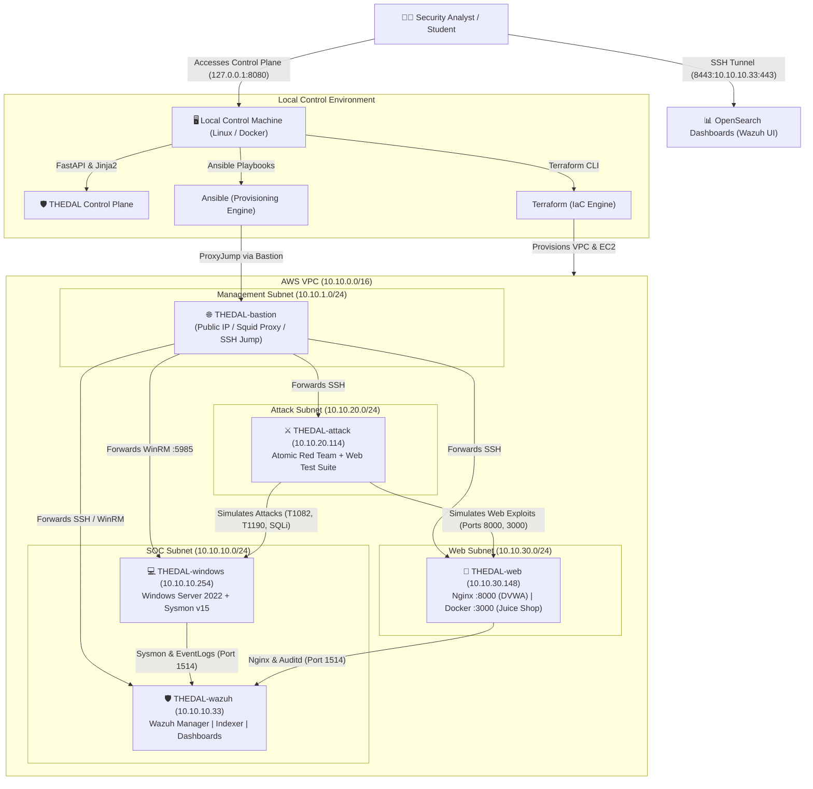

# THEDAL

### Threat Hunting, Exploration, Detection, Analysis and Learn

> **An open-source, reproducible SOC learning environment for threat hunting, detection engineering and incident investigation.**

[](https://opensource.org/licenses/MIT)
[](https://www.terraform.io/)
[](https://www.ansible.com/)
[](https://wazuh.com/)
[](https://opensearch.org/)
[](https://www.python.org/)

---

## 1. Quick Start

THEDAL supports two first-class operator runtime modes:

### Option A: Native Linux / VM (Full CLI + Web Experience)
Recommended for learners who want direct hands-on terminal access to Terraform, Ansible, and AWS CLI:
```bash
git clone https://github.com/EswaranS-06/THEDAL.git
cd THEDAL
./install.sh --mode native
make control-plane
# Open in your browser: http://localhost:8080
```

### Option B: Docker Container (Zero Host Tooling / Browser-First)
Recommended for beginners on Windows, macOS, or Linux who want a zero-configuration, browser-driven experience without installing Terraform or Ansible on the host:
```bash
git clone https://github.com/EswaranS-06/THEDAL.git
cd THEDAL
./install.sh --mode docker
# Open in your browser: http://localhost:8080
```

---

## 2. Runtime Options

| Feature | Native Linux / VM | Docker |
| :--- | :--- | :--- |
| **Control Plane** | Yes | Yes |
| **Terminal commands** | Yes | Optional |
| **Terraform operations** | CLI + UI | UI |
| **AWS start/stop** | CLI + UI | UI |
| **IP synchronization** | CLI + UI | UI |
| **SSH tunnel** | CLI + UI | UI |
| **Wazuh access** | Browser | Browser |
| **Lab simulations** | CLI + UI | UI |

### Windows & macOS Users
Windows and macOS operators can run THEDAL in Docker mode without installing Python, Terraform, or Ansible on their host machine. All cloud orchestration, dynamic SSH access synchronization, and adversary threat simulations run securely inside the container and are managed directly through the Control Plane web interface.

---

## 2. Why THEDAL?

Traditional cybersecurity training often relies on **static capture-the-flag (CTF)** challenges or **passive, pre-recorded PCAP/log dumps**. These approaches fail to teach how real Security Operations Centers (SOCs) operate because:
1. **Lack of Enterprise Context**: Real investigations require distinguishing benign system noise (administrative scripts, routine updates) from genuine attacks.
2. **Missing Process Lineages**: Static logs do not allow analysts to trace parent-child process relationships (Sysmon Event ID 1), examine memory handles, or analyze PowerShell ScriptBlocks (Event ID 4104).
3. **No Multi-Source Correlation**: Analysts must learn how a single adversary action generates correlated ripples across web reverse proxies (Nginx), Docker container logs, Linux kernel syscalls (`auditd`), and Windows EventLogs.

**THEDAL solves this by providing a living, breathing, production-grade cloud laboratory** deployed via Infrastructure as Code (Terraform & Ansible) into Amazon Web Services (AWS).

---

## 3. Core Features

* **All-in-One SIEM & Analytics Core**: Wazuh 4.14.7 Manager, Indexer (OpenSearch backend), and OpenSearch Dashboards with dedicated source-routed indices.
* **Instrumented Windows Endpoint**: Windows Server 2022 pre-configured with **Microsoft Sysmon v15**, PowerShell ScriptBlock Logging (EID 4104), and enhanced Windows auditing.
* **Linux Web Target**: Ubuntu Server hosting **Nginx**, **DVWA** (Damn Vulnerable Web Application on port `8000`), containerized **OWASP Juice Shop** on port `3000`, and Linux kernel `auditd`.
* **Adversary Simulation Engine**: Isolated Linux attack host preloaded with the **Atomic Red Team** framework and automated web security testing engines.
* **Telemetry Routing Pipeline**: Filebeat and OpenSearch Ingest Pipelines routing telemetry into source-specific index patterns (`socforge-sysmon-*`, `socforge-powershell-*`, `socforge-nginx-access-*`, `socforge-auditd-*`, etc.).
* **14 Guided Investigation Labs**: Structured curriculum spanning foundational log anatomy to advanced multi-source attack correlation and incident timeline reconstruction.
* **Zero NAT Gateway Cost Architecture**: Saves ~$32+/month by routing outbound package management through a hardened Squid proxy on the Bastion jumpbox.
* **Local Web Control Plane**: Lightweight, hardened FastAPI dashboard on `127.0.0.1:8080` for safe lifecycle management, EC2 compute pausing, and audit logging.

---

## 4. System Architecture



---

## 5. Guided Learning Path

THEDAL provides a progressive 3-level curriculum plus mystery challenges:

| Level | Focus Area | Labs Included | Key Concepts & MITRE ATT&CK |
| :--- | :--- | :--- | :--- |
| **Level 1: SOC Foundations** | Basic Log Anatomy & Endpoint Telemetry | [Lab 01](docs/labs/01-first-alert/README.md), [Lab 02](docs/labs/02-windows-process/README.md), [Lab 03](docs/labs/03-powershell-investigation/README.md), [Lab 04](docs/labs/04-failed-authentication/README.md) | EventLog vs Alert, Sysmon EID 1 (Process Trees), PowerShell 4104 (ScriptBlocks), Auth Bursts |
| **Level 2: Investigation Workflows** | Web Attacks & Linux Kernel Auditing | [Lab 05](docs/labs/05-dvwa-sqli/README.md), [Lab 06](docs/labs/06-dvwa-command-injection/README.md), [Lab 07](docs/labs/07-dvwa-lfi/README.md), [Lab 08](docs/labs/08-juice-shop-api/README.md) | Nginx access logs, SQL Injection (T1190), Command Injection & `auditd` (T1059.004), LFI (T1083), Container REST APIs |
| **Level 3: Attack Correlation** | Advanced Adversary Emulation & Timelines | [Lab 09](docs/labs/09-atomic-red-team/README.md), [Lab 10](docs/labs/10-powershell-attack/README.md), [Lab 11](docs/labs/11-scheduled-task/README.md), [Lab 12](docs/labs/12-multi-source-correlation/README.md), [Lab 13](docs/labs/13-tp-vs-fp/README.md), [Lab 14](docs/labs/14-incident-timeline/README.md) | Atomic Red Team (T1082), Obfuscation (T1027), Scheduled Tasks (T1053.005), Multi-Source Correlation (`DET-COR-001`), Full Timelines |
| **Challenge Mode** | Unassisted Blind Investigations | [Challenge 01](docs/labs/challenges/challenge-01-web-tampering.md), [Challenge 02](docs/labs/challenges/challenge-02-suspicious-admin.md), [Challenge 03](docs/labs/challenges/challenge-03-stealth-enumeration.md) | Web Tampering, Suspicious Admin Activity, Stealth Host Enumeration |

---

## 6. Infrastructure Specifications

All infrastructure is provisioned inside a single AWS Virtual Private Cloud (`10.10.0.0/16`):

| Node Identifier | Private IP | Instance Type | OS / Image | Role & Installed Telemetry |
| :--- | :--- | :--- | :--- | :--- |
| **THEDAL-bastion** | `10.10.1.131` | `t3.micro` | Ubuntu 22.04 LTS | SSH ProxyJump entry point, Squid Forward Proxy (`:3128`), Public Elastic IPv4 |
| **THEDAL-wazuh** | `10.10.10.33` | `t3.xlarge` | Ubuntu 22.04 LTS | Wazuh Manager, Indexer, OpenSearch Dashboards, Filebeat |
| **THEDAL-windows** | `10.10.10.254` | `t3.small` | Windows Server 2022 | Microsoft Sysmon v15, PowerShell ScriptBlock logging, Wazuh Windows Agent |
| **THEDAL-web** | `10.10.30.148` | `t3.micro` | Ubuntu 22.04 LTS | Nginx Reverse Proxy, DVWA (`:8000`), OWASP Juice Shop (`:3000`), Linux `auditd` |
| **THEDAL-attack** | `10.10.20.114` | `t3.micro` | Ubuntu 22.04 LTS | Atomic Red Team framework, automated web attack engines |

---

## 7. Telemetry & OpenSearch Index Pipeline

Incoming telemetry is classified and routed into source-specific OpenSearch index patterns:

```text
[ Windows Endpoint ] ──► [ Sysmon / WinSec / PowerShell ] ──┐
[ Linux Web Target ] ──► [ Nginx / Auditd / Juice Shop  ] ──┼─► [ Wazuh Manager ] ──► [ Filebeat ] ──► [ OpenSearch Indices ]
[ Adversary Host   ] ──► [ Atomic / Web Simulation Logs ] ──┘
```

| OpenSearch Index Pattern | Source Data Stream | Key Fields Investigated |
| :--- | :--- | :--- |
| `socforge-sysmon-*` | Microsoft Sysmon Operational Log | `data.win.eventdata.image`, `parentImage`, `commandLine`, `processId` |
| `socforge-powershell-*` | PowerShell ScriptBlock (EID 4104) | `data.win.eventdata.scriptBlockText`, `scriptBlockId` |
| `socforge-windows-security-*` | Windows Security EventLog | `data.win.system.eventID` (4624, 4625, 4672, 4688) |
| `socforge-nginx-access-*` | Nginx HTTP Access Logs | `data.srcip`, `data.url`, `data.status`, `data.http_user_agent` |
| `socforge-auditd-*` | Linux Kernel Audit Framework | `data.audit.syscall` (59), `data.audit.exe`, `data.audit.key` |
| `socforge-juice-shop-*` | Juice Shop Docker JSON Logs | `data.docker.container_name`, `data.message` |
| `wazuh-alerts-*` | Aggregated SIEM Alert Stream | `rule.id`, `rule.level`, `rule.description`, `rule.mitre.id` |

---

## 8. Installation & Setup

### Prerequisites

* **Operating System**: Linux (Debian 13 or Ubuntu 22.04+ recommended) or macOS / WSL2.
* **AWS Account**: Configured AWS credentials with permissions for VPC, EC2, IAM, and Security Groups.
* **Required Tools**: `git`, `python3` (3.11+), `terraform` (1.5+), `ansible` (2.14+), `aws-cli` (v2), `ssh`.

### Step 1: AWS Credentials & SSH Key Setup

1. Configure your AWS credentials:
   ```bash
   aws configure
   # Enter AWS Access Key ID, Secret Access Key, and Region (default: ap-south-1)
   ```
2. Verify AWS identity:
   ```bash
   aws sts get-caller-identity
   ```
3. Generate or verify your SSH key pair:
   ```bash
   # Generates ~/.ssh/thedal_key if not present
   ssh-keygen -t ed25519 -f ~/.ssh/thedal_key -N ""
   ```

### Step 2: Deployment via Makefile

```bash
# Verify preflight requirements
make preflight

# Preview Terraform plan
make plan

# Deploy AWS infrastructure
make deploy

# Generate dynamic Ansible inventory from Terraform output
make inventory

# Provision all 5 hosts sequentially
make provision
```

### Step 3: Accessing the Environment

* **Access OpenSearch Dashboards (Wazuh Web UI)**:
  ```bash
  # Launch the SSH tunnel through the Bastion
  make tunnel
  # Open https://localhost:8443 in your browser (Credentials: admin / SOCForge_Adm1n_Lab2026!)
  ```
* **Launch the Local Control Plane**:
  ```bash
  make control-plane
  # Open http://127.0.0.1:8080 in your browser
  ```

---

## 9. AWS Cost & Safety Controls

> [!WARNING]
> **Cloud Cost Notice**: Running EC2 instances incurs AWS charges. Always manage your compute lifecycle.

* **Zero NAT Gateway Policy**: Eliminates ~$32+/month in AWS NAT Gateway fees by utilizing the Squid forward proxy on `THEDAL-bastion`.
* **Single Public IPv4**: Only the Bastion jumpbox allocates an Elastic IPv4 address.
* **Stopping vs. Destroying**:
  * **Pausing (`make stop-ec2`)**: Halts hourly compute charges; attached EBS disk storage charges continue.
  * **Complete Teardown (`make destroy`)**: Terminates all compute instances and deletes EBS volumes, eliminating recurring charges completely.

```bash
# Pause compute fleet (save compute costs)
make stop-ec2

# Resume compute fleet
make start-ec2

# Permanently destroy all AWS assets
make destroy
```

---

## 10. Repository Structure

```text
THEDAL/
├── Makefile                     # Root developer automation & workflow CLI
├── install.sh                   # Universal interactive Linux installer
├── index.html                   # Public project website (GitHub Pages)
├── css/                         # Public website stylesheet
├── js/                          # Public website scripts
├── terraform/                   # Infrastructure as Code (VPC, Subnets, EC2, IAM)
├── ansible/                     # Host configuration playbooks & roles
│   ├── inventory/               # Dynamic inventory (hosts.ini)
│   ├── playbooks/               # Modular provisioning playbooks (1-8)
│   └── roles/                   # Reusable Ansible roles
├── control-plane/               # Local FastAPI web operations dashboard
│   ├── app/                     # Backend routes, services, templates
│   └── tests/                   # Control plane unit & API tests
├── detection/                   # Custom Wazuh detection rules & decoders
├── attacks/                     # Adversary emulation & web test scripts
├── docs/                        # Complete project documentation & learning path
│   ├── START-HERE.md            # Onboarding & beginner's guide
│   ├── learning-path.md         # Guided 3-level SOC curriculum
│   ├── labs/                    # 14 guided investigation labs & challenges
│   ├── runbooks/                # 7 analyst triage runbooks
│   └── templates/               # Incident report & triage checklist templates
└── scripts/                     # Operational verification & health check scripts
```

---

## 11. Testing & Validation

```bash
# Run full repository syntax and lint checks
make lint

# Run control plane unit and API test suite (15 tests)
make test-control-plane

# Execute end-to-end cloud health verification
make health-check
```

---

## 12. Troubleshooting

| Symptom | Probable Cause | Recommended Remediation |
| :--- | :--- | :--- |
| `WinRM connection refused` on Windows | Windows still running bootstrap setup | Wait 2–3 minutes after initial boot for Sysprep to complete. |
| `Wazuh agent disconnected` | Service restart or network delay | Check agent status: `systemctl status wazuh-agent` on target. |
| `Squid proxy connection timeout` | Bastion security group rule | Ensure port `3128` is open to internal VPC CIDR `10.10.0.0/16`. |
| `Wazuh dashboard TLS warning` | Self-signed certificate | Accept the self-signed certificate warning in your browser. |

---

## 13. Contributing

Contributions are welcome! To contribute:
1. Fork the repository on GitHub.
2. Create a feature branch (`git checkout -b feat/new-detection-rule`).
3. Ensure all tests pass (`make lint && make test-control-plane`).
4. Submit a Pull Request with clear test evidence.

---

## 14. Security & Responsible Use

> [!CAUTION]
> **Authorized Testing Only**: The attack simulation engines included in THEDAL are designed strictly for testing the isolated private subnets within your own AWS account. Never target unauthorized external systems.

---

## 15. License

This project is open source and distributed under the **[MIT License](LICENSE)**.
